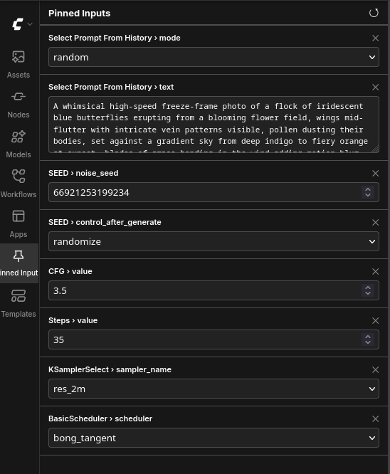

# 📌 Pin Node Input

A ComfyUI extension that lets you **pin any widget from any node to a sidebar panel**, so you can tweak the settings you change constantly — prompts, seed, steps, CFG, resolution — without hunting across the canvas between runs.

No extra nodes, no workflow restructuring. Pin a widget, change it from the sidebar, done.



## Features

- **Pin / unpin any widget** via the node's right-click menu → *📌 Pin widget…*
- **Sidebar panel** with native-feeling controls for every widget type:
  - dropdowns (samplers, schedulers, checkpoints, …)
  - numbers with correct int/float handling, min/max and step
  - toggles
  - multiline text areas for prompts
- **Live two-way sync** — change a value on the canvas (or let `randomize` roll a new seed after each run) and the panel updates within ~0.6 s. Change it in the panel and the node updates instantly.
- **Seed convenience** — pinning a `seed` / `noise_seed` widget automatically pins its `control_after_generate` companion.
- **Drag to reorder** — grab the ⠿ handle on any row to rearrange pins; the order is saved with the workflow.
- **Click a pin's label** to center the canvas on its source node.
- **Pins are saved inside the workflow** (`.json`), so every workflow remembers its own pinned set and they travel with the file when you share it.
- Frontend-only: adds **zero Python nodes** and does not touch your graph or outputs.

## Installation

### Via ComfyUI Manager (recommended)

1. Open **Manager → Custom Nodes Manager**
2. Search for **Pin Node Input**
3. Install and restart ComfyUI

### Manual

```bash
cd ComfyUI/custom_nodes
git clone https://github.com/dawncreatescode/comfyui-pin-node-input.git
```

Restart ComfyUI and hard-refresh your browser (Ctrl+Shift+R) so the frontend script loads.

**Requirements:** a recent ComfyUI with the new frontend (the default since mid-2024). No Python dependencies.

## Usage

1. **Pin something:** right-click any node → **📌 Pin widget…** → click a widget name. A ✓ marks widgets that are already pinned; clicking them again unpins.
2. **Open the panel:** click the **📌 thumbtack icon** in the sidebar.
3. **Edit values** directly in the panel — changes apply to the node immediately.
4. **Unpin** with the ✕ on a row, or via the same right-click menu.
5. **Save your workflow** as usual; pins are stored in it and restored on load.

The ↺ button in the panel header forces a full rebuild — useful if dropdown contents changed (e.g. you added a model file) or you renamed a node and want the label updated.

### Stale pins

If a pinned node is deleted or its widget is converted to an input, the row shows *⚠ Widget not found* instead of breaking. Unpin it, or undo the deletion and the row comes back to life automatically.

## How it works (for the curious)

- A pin is just a reference — `{nodeId, widgetName}` — stored in `graph.extra`, which ComfyUI serializes inside the workflow JSON.
- Panel controls proxy the real LiteGraph widgets: writes set `widget.value` and fire the widget's callback; reads happen via a lightweight sync loop (600 ms, only while the panel is mounted) that never overwrites a control you're currently typing in.
- The panel is registered through the official `app.extensionManager.registerSidebarTab` API, so it follows your ComfyUI theme and survives frontend updates better than hacks into internal components.

## Known limitations
- Widgets converted to inputs have no local value and therefore can't be edited from the panel (shown as stale).
- Image/file upload widgets and button widgets are intentionally not pinnable.

## License

MIT — see [LICENSE](LICENSE).
